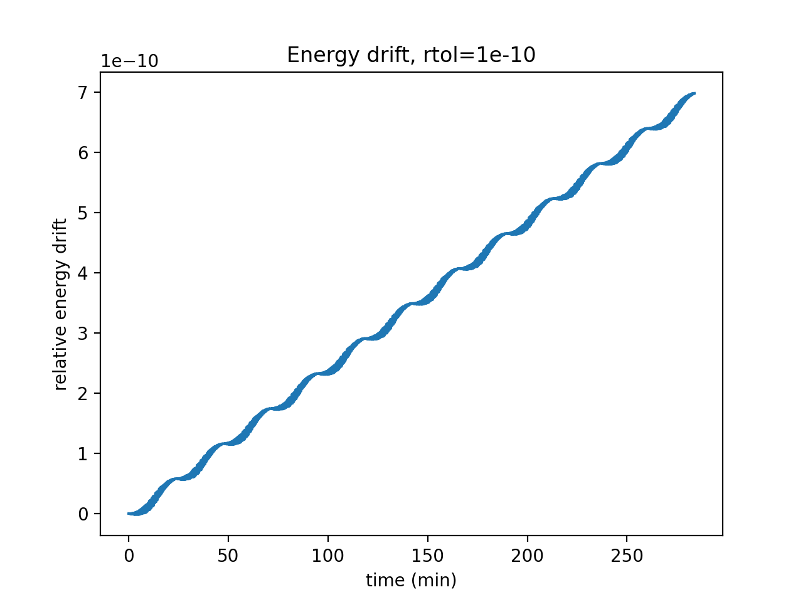
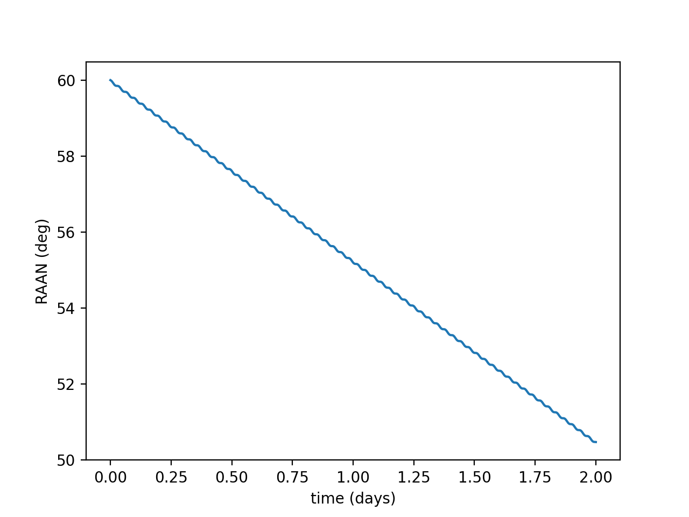
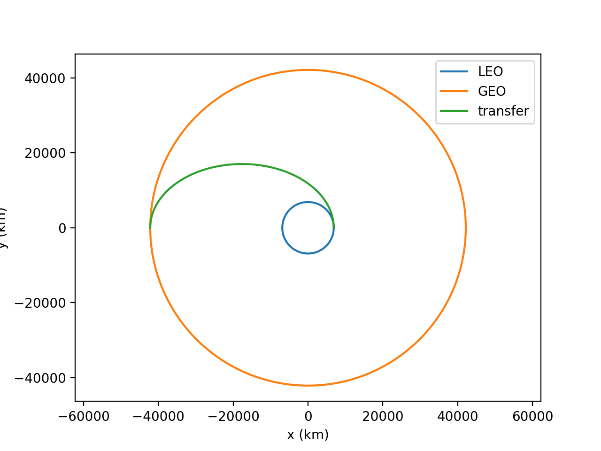

# Orbit Propagator

A two-body orbit propagator with J2 perturbation, built from scratch in Python (NumPy/SciPy) to learn astrodynamics fundamentals.

## Features
- Two-body integrator with energy and angular momentum conservation checks
- Orbital elements <-> position/velocity conversion
- J2 (Earth oblateness) perturbation
- Hohmann transfer and Lambert solver

## Validation
| Test | Result |
|---|---|
| Energy drift, rtol=1e-10 (3 orbits) | ~7e-10 |
| Energy drift, rtol=1e-4 (3 orbits) | ~1e-2 |
| Element round trip | error ~1e-12 |
| Hohmann LEO to GEO | final radius 42164.00002 km vs 42164 target (error 2e-5 km); total Δv 3.816 km/s, TOF 5.31 h |
| Lambert (textbook case) | miss distance 1.1e-6 km |
| J2 RAAN drift | -4.7646 vs -4.7527 deg/day, 0.25% error |

## Results

## Run
    pip install numpy scipy matplotlib
    python examples/j2_raan.py